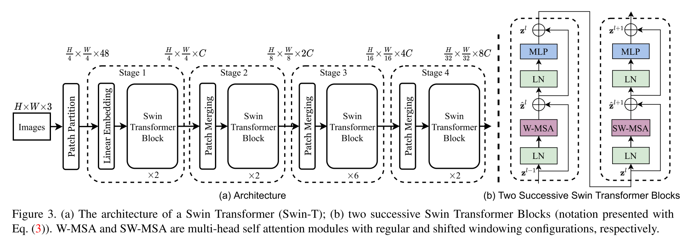

# Swin Transformer Implementation of C++

> reference: [https://github.com/berniwal/swin-transformer-pytorch](https://github.com/berniwal/swin-transformer-pytorch)

This is Swin Transformer C++ Implementation, inspired
by [swin-transformer-pytorch](https://github.com/berniwal/swin-transformer-pytorch).

The official Pytorch Implementation can be found
in [https://github.com/microsoft/Swin-Transformer](https://github.com/microsoft/Swin-Transformer)

## Structure



## Build and Run
> Linux required, cmake(version 3.16 and higher), make

build:
```shell
git clone https://github.com/dianhsu/swin-transformer-cpp
cd swin-transformer-cpp
mkdir build
cd build
cmake ..
make
```
run:
```shell
./swin-transformer-cpp
```